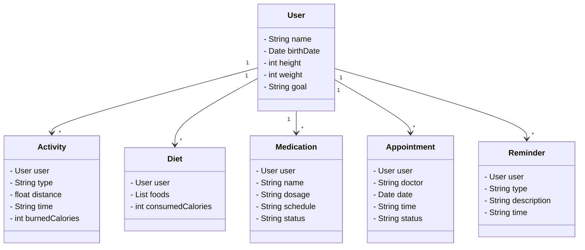

# Desafio de Projeto
Java RESTful API criada para o Java AI Powered

Projeto: Sistema de Gestão de Saúde

```mermaid
classDiagram
    class User {
        - String name
        - Date birthDate
        - int height
        - int weight
        - String goal
    }

    class Activity {
        - User user
        - String type
        - float distance
        - String time
        - int burnedCalories
    }

    class Diet {
        - User user
        - List<String> foods
        - int consumedCalories
    }

    class Medication {
        - User user
        - String name
        - String dosage
        - String schedule
        - String status
    }

    class Appointment {
        - User user
        - String doctor
        - Date date
        - String time
        - String status
    }

    class Reminder {
        - User user
        - String type
        - String description
        - String time
    }

    User "1" --> "*" Activity
    User "1" --> "*" Diet
    User "1" --> "*" Medication
    User "1" --> "*" Appointment
    User "1" --> "*" Reminder
```
